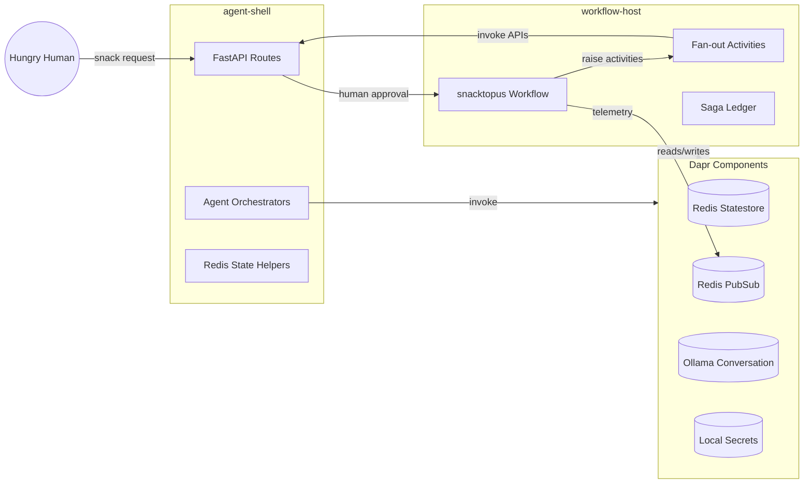

Abraka-Dapra (Agent + Workflow Remix)
====================================

Tiny repo, big vibes. The goal: mash Dapr Agents with Dapr Workflows so a per-user durable helper can reason, remember, and still phone a human friend before things get weird.

Mission Snapshot
----------------
- Durable snack concierge built from two Python services: `agent-shell` (FastAPI + Dapr Agents) and `workflow-host` (Dapr Workflows runtime).
- Shared Redis + Ollama components managed through Dapr so each service focuses on prompts, safety, and saga logic.
- Human-in-the-loop checkpoints to keep the "Operation Snacktopus" adventure playful but safe.

Quick Start with Docker Compose
--------------------------------
The fastest way to get everything running is with Docker Compose:

```bash
# Build and start all services (Redis, Ollama, Dapr, agent-shell, workflow-host)
make docker-build
make docker-up

# Initialize Ollama with the LLM model (takes 5-10 minutes)
make docker-init-ollama

# Run end-to-end tests
make docker-test

# View logs
make docker-logs

# Stop everything
make docker-down
```

See [Docker Setup Guide](docs/DOCKER_SETUP.md) for detailed documentation.

Coding Principles
------------------
The codebase leans on two favourites—*Grokking Simplicity* and *A Philosophy of Software Design*—to stay understandable as the system grows. See `docs/CODEX_INSTRUCTIONS.md` for the full guidance, but in short:
- Separate calculations from actions so workflow logic remains testable and side effects live near the edges.
- Pursue deep modules with clear interfaces, hiding incidental complexity behind well-named helpers.
- Model durable state transitions explicitly (memory, sagas, approvals) instead of ad-hoc dictionaries, and explain tricky choices inline when necessary.

Working with Python `uv`
------------------------
`uv` (by Astral) is a modern, ultra-fast Python project manager that combines dependency resolution, virtualenvs, and scripting. The plan for this repo:

1. **Install `uv`**
   - macOS (Homebrew): `brew install uv`
   - Cross-platform script: `curl -LsSf https://astral.sh/uv/install.sh | sh`
2. **Pin Python**
   - `uv python install 3.13.7`
   - `uv python pin 3.13.7` (writes `.python-version` so both `uv` and `pyenv` agree)
3. **Initialize the workspace**
   - `uv init --name abraka_dapra`
   - Edit the generated `pyproject.toml` to enable a [shared source layout](#proposed-repository-layout) and declare two entry points (`agent-shell` and `workflow-host`).
4. **Add runtime dependencies**
   - `uv add fastapi uvicorn[standard] dapr dapr-ext-workflow dapr-agents redis pydantic-settings python-dotenv`
5. **Add developer tooling**
   - `uv add --dev ruff pytest pytest-asyncio typer rich locust`
6. **Sync & lock**
   - `uv lock` (creates `uv.lock`)
   - `uv sync --shared` (materializes `.venv/` and ensures scripts see the same environment)
7. **Run commands without activating a venv**
   - `uv run fastapi dev src/agent_shell/main.py`
   - `uv run pytest`
   - `uv run make dev` (keeps `Makefile` targets clean and reproducible)

`uv` keeps dependency resolution deterministic and fast, so CI, local dev, and ad-hoc scripts share the same lockfile.

Proposed Repository Layout
--------------------------
```
abraka-dapra/
├── pyproject.toml          # uv-managed project definition (two apps, shared tooling)
├── uv.lock                 # frozen dependency graph
├── Makefile                # dev/test/run targets powered by `uv run`
├── .env.example            # copy to `.env`; lists ports, Ollama model, saga timeouts
├── components/             # Dapr component YAML (Redis state/pubsub, Ollama connector, secrets)
├── configs/
│   └── snacktopus.json     # approval thresholds, retry budgets, feature flags
├── docs/
│   ├── OPERATION_SNACKTOPUS_SPEC.md
│   ├── OPERATION_SNACKTOPUS_TESTPLAN.md
│   └── operations.md       # incident runbook (Redis, Ollama, human UI outages)
├── prompts/                # agent prompt templates (answer, evaluator, history, profile, safety)
├── scripts/
│   ├── seed_memory.py      # bootstrap state store with canned transcripts/preferences
│   └── send_event.py       # CLI helper to raise workflow saga events (human/ops/supply)
├── src/
│   ├── agent_shell/
│   │   ├── __init__.py
│   │   ├── main.py         # FastAPI entry point wired to Dapr sidecar
│   │   ├── routers/        # `/ask`, `/history`, `/profile`, `/safety`, `/human/decision`
│   │   ├── services/       # orchestrates agents, memory summarizer, telemetry
│   │   ├── clients/        # Dapr clients, Redis helpers, Ollama wrappers
│   │   └── models/         # Pydantic request/response & memory schemas
│   ├── workflow_host/
│   │   ├── __init__.py
│   │   ├── main.py         # Workflow host bootstrapping + Dapr registration
│   │   ├── workflows/      # `snacktopus` definition & compensation sagas
│   │   ├── activities/     # fan-out enrichment, answer call, telemetry sink
│   │   ├── clients/        # Dapr workflow + state/pubsub helpers
│   │   └── models/         # saga ledger, metrics payloads, approval events
│   └── shared/
│       ├── __init__.py
│       ├── settings.py     # pydantic-settings loader pulling from `.env`
│       ├── logging.py      # structured logging & trace helpers
│       └── telemetry.py    # Zipkin/OpenTelemetry annotations reused by both apps
├── tests/
│   ├── conftest.py
│   ├── integration/
│   │   ├── test_happy_path.py
│   │   └── test_compensations.py
│   ├── workflow/
│   │   └── test_snacktopus.py
│   └── load/
│       └── locustfile.py
└── .github/
    └── workflows/
        └── ci.yaml         # lint (ruff), unit tests, smoke workflow launch via `uv run`
```

System Wiring (Mermaid)
-----------------------


Make Targets & Runtime Flow
---------------------------
Planned `Makefile` commands (invoked via `uv run make <target>`):
- `make dev`: format + lint (`ruff check --fix`), run unit tests, ensure docs build
- `make run-agent`: `dapr run --app-id agent-shell --app-port 8000 -- uv run uvicorn src.agent_shell.main:app --reload`
- `make run-workflow`: `dapr run --app-id workflow-host --app-port 7000 -- uv run python src/workflow_host/main.py`
- `make test`: `uv run pytest`

Dapr Components
---------------
- `components/statestore.yaml`: Redis-backed state store (actors enabled); ensure Redis is running locally (example: `docker run --rm -p 6379:6379 redis:7`).
- `components/ollama.yaml`: Conversation connector targeting a local Ollama (OpenAI-compatible) server.
   - Env precedence: if `OLLAMA_API_KEY` is set, its value is used; otherwise the component attempts `apiKeySecretRef` → `secrets.json` (`{"ollama": {"apiKey": "..."}}`).
   - Local Ollama ignores the Authorization header, so you can leave the key blank for development.
   - Change model by editing metadata `model` (e.g., `llama3:8b`); restart sidecar to apply.
- `components/pubsub.yaml`: Redis pub/sub definition for workflow telemetry and fan-out.
- `components/secretstore.yaml`: File-based secret store backing optional secrets (edit `components/secrets.json`).
- `components/zipkin.yaml`: Zipkin trace exporter; ensure Zipkin running on `localhost:9411` or remove the component.

Multi-App Runner
----------------
`manifests/dapr.yaml` implements the [Dapr multi-app run template](https://docs.dapr.io/developing-applications/local-development/multi-app-dapr-run/multi-app-template/) so both services start with a single command. The file wires shared components via `resourcesPaths` and launches each process with `uv run`:

```bash
# from repository root
cp components/secrets.json.sample components/secrets.json  # edit if needed
cp .env.example .env                                       # optional
dapr run -f manifests
```

The CLI keeps each app's logs under `~/.dapr/logs` and you can stop the bundle with `dapr stop -f manifests`. For solo debugging, lean on `make run-agent` / `make run-workflow` (both use `dapr run` under the hood) so the manifest definitions stay in one place.

The template now mounts the Redis state store by default, so be sure Redis is listening on `localhost:6379` before running. To layer in pub/sub or the Ollama connector, rename the matching component files (drop the `.disabled` suffix), start the backing service, and update `.env`/`components/secrets.json` as needed.
Ollama Activation Quickstart
----------------------------
1. Install & start Ollama (https://ollama.com) so it serves `http://localhost:11434`.
2. Pull a model (example): `ollama pull deepseek-r1:8b`.
3. (Optional) Set env var if you want a placeholder key:
   ```bash
   export OLLAMA_API_KEY=not-required-local
   ```
4. (Optional) Or set a secret instead: copy `components/secrets.json.sample` to `components/secrets.json` and adjust the value.
5. Run both apps via manifest: `dapr run -f manifests` or individually with `make run-agent`.
6. Verify component registration:
   ```bash
   curl -s http://localhost:3500/v1.0/metadata | grep -i ollama
   ```
7. Send a test chat (raw OpenAI style) directly to Ollama to confirm model is loaded:
   ```bash
   curl -s -H 'Content-Type: application/json' \
        -d '{"model":"deepseek-r1:8b","messages":[{"role":"user","content":"hello"}]}' \
        http://localhost:11434/v1/chat | jq '.'
   ```

Workflow Narrative
------------------
"Operation Snacktopus" tries every trick at once:
1. Durable User Agent greets the user, pulls context, and asks the Safety Agent if the snack request violates the "no deep-fried existential dread" policy.
2. Parallel fetch: History Agent hunts transcripts, Profile Agent grabs favorite condiments, Embedding Agent vectors the craving, Workflow fans responses back.
3. Answer Agent drafts a menu, Evaluator grades spice puns, and the Workflow pauses on a `humanApproval` task so an on-call teammate can veto the haunted gelatin idea.
4. If the human laughs and approves, the Workflow resumes, files telemetry, publishes a celebration event, and the Memory Agent distills the chaos into a polite summary.

Workflow Patterns in Play
-------------------------
- **Fan-out/Fan-in enrichment**: context agents run in parallel branches, rejoin to form the snack dossier before drafting the answer.
- **Human interaction (external event)**: the workflow waits on `humanApproval`, matching Dapr’s external event pattern so people can bless or block risky suggestions.
- **Compensation mini-saga**: if safety spikes or humans reject the platter, compensating activities rewind memory updates, emit caution metrics, and surface a polite fallback menu.

Learn More Without a Crystal Ball
---------------------------------
- Agents overview: https://docs.dapr.io/developing-applications/dapr-agents/
- Workflow patterns: https://docs.dapr.io/developing-applications/building-blocks/workflow/workflow-patterns/
- Workflow concepts: https://docs.dapr.io/developing-applications/building-blocks/workflow/

Grab a mug, wire up a Workflow, and keep a human in the loop for the weird bits. 🌀
