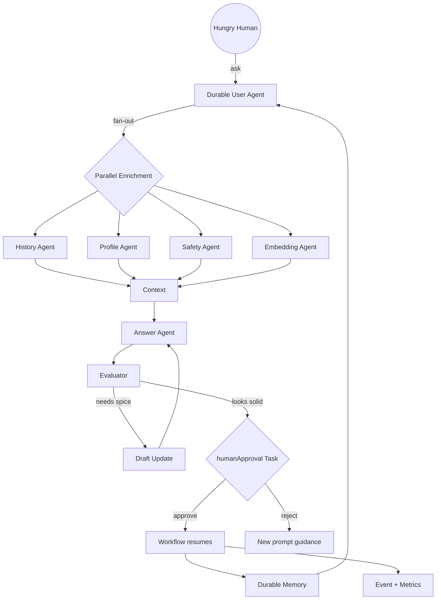

Abraka-Dapra (Agent + Workflow Remix)
====================================

Tiny repo, big vibes. The goal: mash Dapr Agents with Dapr Workflows so a per-user durable helper can reason, remember, and still phone a human friend before things get weird.

Core Ingredients
----------------
- `Dapr Agents`: role-based sidekicks (history, profile, safety, answer, evaluator) with scoped tools and memory. They live as declarative manifests, swap models easily, and tap into bindings/pubsub without glue code.
- `Dapr Workflows`: deterministic backbone for fan-out enrichment, confidence scoring, retries, and replay-safe pruning. Durable state keeps every user on their own rails.
- Shared state & secrets stay in Dapr component config so the app code can focus on prompts, scoring, and memory rules.

Mermaid Snapshot
----------------

Kitchen-Sink Fever Dream
------------------------
"Operation Snacktopus" tries every trick at once:
1. Durable User Agent greets the user, pulls context, and asks the Safety Agent if the snack request violates the "no deep-fried existential dread" policy.
2. Parallel fetch: History Agent hunts transcripts, Profile Agent grabs favorite condiments, Embedding Agent vectors the craving, Workflow fans responses back.
3. Answer Agent drafts a menu, Evaluator grades spice puns, and the Workflow pauses on a `humanApproval` task so an on-call teammate can veto the haunted gelatin idea.
4. If the human laughs and approves, the Workflow resumes, files telemetry, publishes a celebration event, and the Memory Agent distills the chaos into a polite summary.

Learn More Without a Crystal Ball
---------------------------------
- Agents overview: https://docs.dapr.io/developing-applications/dapr-agents/
- Workflow concepts: https://docs.dapr.io/developing-applications/building-blocks/workflow/
- Sample manifests & prompts will land once TODOs below start clearing.

Grab a mug, wire up a Workflow, and keep a human in the loop for the weird bits. 🌀
