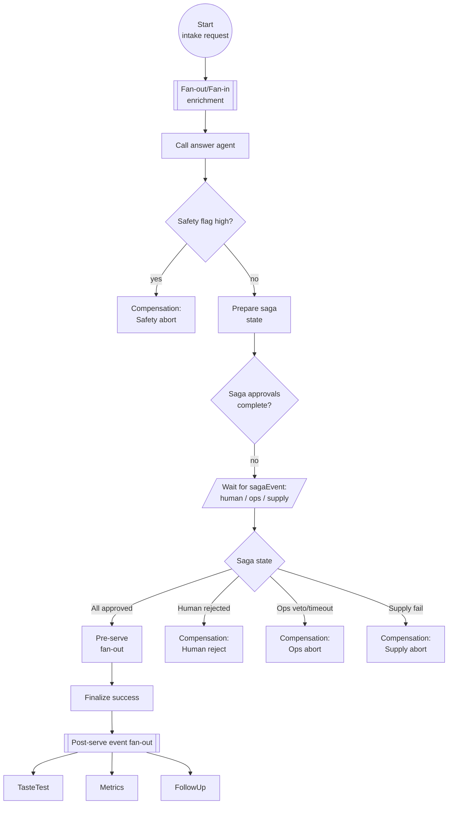

Operation Snacktopus Workflow Design
===================================

Objectives
----------
- Orchestrate snack recommendations using layered Dapr Workflow patterns: fan-out/fan-in enrichment, saga-style multi-party approvals, and downstream event choreography.
- Keep workflow deterministic while delegating creative reasoning to Dapr Agents.
- Ensure safety, multi-party vetoes, or downstream quality checks trigger compensating activities that leave the system consistent.

Mermaid Overview
----------------


Workflow Structure
------------------
1. **Start** (`snacktopus` instance)
   - Input: `{question: str, session: str, metadata?: dict}`.
   - Initialize run metadata (`RunMetadata`) and empty compensation ledger.

2. **Fan-out/Fan-in Enrichment**
   - Activities: `fetch_history`, `fetch_profile`, `safety_screen`, optional `embedding_lookup`.
   - Pattern: classic Dapr fan-out/fan-in; aggregate into `context_bundle`.
   - Mitigation: retries with backoff; partial context flagged but does not halt.

3. **Draft Answer**
   - Activity: `call_answer_agent` through Dapr service invocation.
   - Output includes `draft`, `scores`, `safetyFlag`, staged `memoryDelta`, and saga requirements `{human, ops, supply}`.

4. **Safety Check**
   - Immediate compensation if `safetyFlag == HIGH`.

5. **Saga Kickoff**
   - Persist empty `SagaState` `{human:None, ops:None, supply:None}` via state store.
   - Determine which approvals are required (feature flag friendly).

6. **Saga Approval Wait (Event-driven)**
   - Workflow loops waiting on `sagaEvent` external events.
   - Events: `{kind:"human"|"ops"|"supply", approved: bool, notes?: str}`.
   - Order-independent; duplicates ignored; events stored in `SagaState`.
   - Timeout triggers `Compensation:OpsAbort` (covers missing any approval).

7. **Pre-Serve Checks (Out-of-saga Fan-out)**
   - Once saga approves, run secondary parallel checks:
     - `temperature_check` (ensure warm/cold requirements).
     - `palate_match` (enrich answer with playful pairing).
     - `supply_hold` (reserve inventory; emits event if low stock).
   - Failures here do **not** reopen saga but trigger targeted compensation (`SupplyAbort`).

8. **Finalize Success**
   - Activities: `persist_memory`, `publish_metrics`, `update_run_status`.
   - Memory update committed; ledger cleared.

9. **Post-Serve Event Choreography**
   - Workflow fan-out publishes asynchronous follow-ups:
     - `taste_test` child workflow (collect feedback later).
     - `metrics` pubsub event for analytics pipeline.
     - `follow_up` delayed reminder (scheduled via `create_timer`).

Compensation Branches
---------------------
### Safety Abort (`Compensation:SafetyAbort`)
- Trigger: high safety flag.
- Steps: publish risk event, persist safe summary, emit fallback answer.
- Status: `FAILED_SAFETY`; memory delta discarded.

### Human Reject (`Compensation:HumanReject`)
- Trigger: saga event `{kind:"human", approved:false}`.
- Steps: rollback memory, publish rejection metric, offer alternative plan.
- Status: `REJECTED_BY_HUMAN`.

### Ops Abort (`Compensation:OpsAbort`)
- Trigger: ops veto or saga timeout.
- Steps: rollback memory, publish ops abort metric, notify ops failure.
- Status: `ABORTED_BY_OPS`.

### Supply Abort (`Compensation:SupplyAbort`)
- Trigger: pre-serve supply check fails or supply saga event negative.
- Steps: release inventory holds, log supply issue, craft backorder response.
- Status: `ABORTED_SUPPLY`.

Python Event-driven Saga + Post Events
--------------------------------------
```python
from datetime import timedelta
from dapr.ext.workflow import workflow, activity

SAGA_TIMEOUT = timedelta(minutes=5)
POST_SERVE_DELAY = timedelta(minutes=30)

@activity()
async def fetch_context(ctx, payload): ...

@activity()
async def call_answer_agent(ctx, payload): ...

@activity()
async def handle_safety_abort(ctx, payload): ...

@activity()
async def handle_human_reject(ctx, payload): ...

@activity()
async def handle_ops_abort(ctx, payload): ...

@activity()
async def handle_supply_abort(ctx, payload): ...

@activity()
async def run_pre_serve_checks(ctx, payload): ...

@activity()
async def finalize_success(ctx, payload): ...

@activity()
async def publish_post_events(ctx, payload): ...

@workflow()
def snacktopus(ctx, payload: dict):
    bundle = yield ctx.call_activity(fetch_context, payload)
    answer = yield ctx.call_activity(call_answer_agent, {**payload, **bundle})

    if answer["safetyFlag"] == "HIGH":
        yield ctx.call_activity(handle_safety_abort, {"payload": payload, "answer": answer})
        return {"status": "FAILED_SAFETY"}

    saga_flags = answer.get("sagaFlags", {"human": True, "ops": True, "supply": False})
    saga_state = {key: None for key, needed in saga_flags.items() if needed}
    deadline = ctx.current_utc_datetime() + SAGA_TIMEOUT

    while saga_state:
        remaining = [k for k, v in saga_state.items() if v is None]
        if not remaining:
            break
        timeout = deadline - ctx.current_utc_datetime()
        if timeout <= timedelta(seconds=0):
            yield ctx.call_activity(handle_ops_abort, {"payload": payload, "answer": answer, "reason": "timeout"})
            return {"status": "ABORTED_TIMEOUT"}
        event = yield ctx.wait_for_external_event("sagaEvent", timeout=timeout)
        kind = event.get("kind")
        if kind not in saga_state or saga_state[kind] is not None:
            continue
        saga_state[kind] = event
        if not event.get("approved", False):
            handler = {
                "human": handle_human_reject,
                "ops": handle_ops_abort,
                "supply": handle_supply_abort,
            }[kind]
            yield ctx.call_activity(handler, {"payload": payload, "answer": answer, "event": event})
            return {"status": f"ABORTED_{kind.upper()}"}

    pre_serve = yield ctx.call_activity(run_pre_serve_checks, {"payload": payload, "answer": answer})
    if not pre_serve.get("ok", True):
        yield ctx.call_activity(handle_supply_abort, {"payload": payload, "answer": answer, "checks": pre_serve})
        return {"status": "ABORTED_SUPPLY"}

    result = yield ctx.call_activity(finalize_success, {"payload": payload, "answer": answer, "preServe": pre_serve})

    # schedule post-serve follow-ups
    ctx.create_timer(POST_SERVE_DELAY)
    yield ctx.call_activity(publish_post_events, {
        "payload": payload,
        "answer": answer,
        "preServe": pre_serve,
        "saga": saga_state,
    })
    return {"status": "COMPLETED", "answer": result.get("answer", answer["draft"])}
```

Raising Saga & Post Events
-------------------------
- Human approval UI publishes `sagaEvent` with `{kind:"human", approved:bool}`.
- Ops automation posts `{kind:"ops", approved:bool, inventory:int}`.
- Supply microservice can either contribute via saga event or respond during `run_pre_serve_checks`.
- `publish_post_events` emits pubsub messages (`workflow-metrics`, `taste-test.request`, `follow-up.schedule`) to drive downstream event-driven systems.

Activity Contracts & State
--------------------------
- Activities publish structured results; saga ledger stored via state store for deterministic replay.
- `run_pre_serve_checks` returns `{ok: bool, issues: [...]}` to signal follow-up flows.
- Post events include correlation IDs to tie asynchronous child workflows back to the main run.

Determinism Considerations
--------------------------
- Saga events handled idempotently; duplicates ignored, state persisted before decisions.
- Timers only created after success path to avoid replay drift.
- Compensation handlers wrap all external side effects with ledger checks.

Extension Hooks
---------------
- Add finance approval by toggling `sagaFlags.finance` and extending handler mapping.
- Launch child workflows per post-event (e.g., `taste_test` collects user feedback asynchronously).
- Integrate supply chain pubsub listener to auto-raise `sagaEvent` when restock arrives.

Next Steps
----------
- Implement saga state utilities and ledger helpers.
- Create activity stubs and tests for saga, pre-serve checks, and post-event fan-out.
- Document event schemas for `sagaEvent`, `workflow-metrics`, `taste-test.request`, and compensation emissions.
